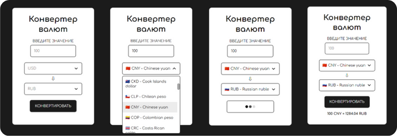

# Конвертер валют
[Опубликованная версия🡕](https://eslichtne-currency-converter.netlify.app/)

## Описание 
Веб-приложение для конвертации валют. Позволяет пользователям легко и быстро переводить суммы из одной валюты в другую.

API-ключ и данные взяты из сервиса [ExchangeRate-API🡕](https://app.exchangerate-api.com/dashboard)
<h2 style="display: flex; gap: 5px !important">Функциональные возможности</h2>

### **Выбор валют**
- Пользователи могут выбирать валюты из выпадающих списков или вводить название непосредственно в поле;
- Список фильтруется по мере ввода;
- Выбранная валюта отображается в поле ввода.
### **Конвертация** 
- Пользователи вводят сумму в одной валюте и видят эквивалентную сумму в выбранной второй валюте.
### **Автоматическое обновление курсов обмена** 
- Курсы обмена валют автоматически загружаются с использованием API, обеспечивая актуальные результаты конвертации.
### **Обработка ошибок** 
- При возникновении ошибок, таких как неудачная загрузка данных или отсутствие введенных значений, выводятся соответствующие сообщения.
<h2 style="display: flex; gap: 5px">Используемые технологии</h2>

### **HTML / CSS / JavaScript** 
- Основные технологии для разработки веб-приложения.
### **Fetch API** 
- Интерфейс Fetch API используется для выполнения сетевых запросов.
### **API** 
- Внешний API (ExchangeRate-API) используется для получения актуальных курсов валют и данных о странах.
### **ARIA** 
- Атрибуты ARIA (Accessible Rich Internet Applications) используются для обеспечения доступности веб-приложения для пользователей с ограниченными возможностями.
<h2 style="display: flex; gap: 5px">Архитектура</h2>

### **Модульный код**
- Программа разделена на небольшие функции, каждая из которых отвечает за свой функционал.
### **Чистая структура**
- Понятные имена функций обеспечивают читаемость кода.
### **Комментарии**
- Код снабжен комментариями, которые объясняют его функциональность.
<h2 style="display: flex; gap: 5px">Преимущества</h2>

### **Адаптивный дизайн** 
- Веб-приложение имеет адаптивный дизайн, обеспечивающий одинаково хороший пользовательский опыт на различных устройствах.
### **Кроссбраузерность** 
- Веб-приложение ведёт себя одинаково в последних версиях основных браузеров.
### **Доступность** 
- Семантическая вёрстка и использование aria-атрибутов способствуют повышению уровня доступности для пользователей с ограниченными возможностями.
